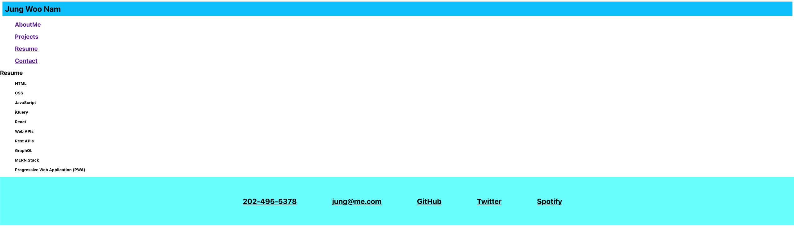

# homework-20-react-portfolio

# Description

This was my homework #20 react portfolio. I was tasked with creating a portfolio using react.

This is my first time creating a react portfolio, it's not where it should be. However, I'm hoping I can build on top of this throughout my developer career.

# Installation

# Usage

Please follow the directions from README file.

# Contributing

Please follow the directions from README file.

# Tests

Please follow the directions from README file.

# Questions

Need to contact [jung0808?](https://github.com/jung0808)  
[You can contact me here - Email](mailto:j.nam0808@gmail.com)

# Screenshot of Project

##   Attached is also a personal link to my homework assignment #18.

 

## https://github.com/jung0808/homework-20-react-portfolio

##
